# 大模型部署与测试实验报告

## 一、实验目标

- 学习ModelScope平台使用
- 掌握大模型本地部署流程
- 实现非量化CPU推理
- 对比不同模型性能表现

## 二、实验环境搭建

### 2.1 平台准备

#### ModelScope平台注册与配置

1. 访问 [ModelScope官网](https://www.modelscope.cn/home)
2. 点击右上角完成新用户注册
3. 登录后绑定阿里云账号
4. 获得免费的配套云计算资源

#### 云服务器资源获取

- 启动CPU服务器实例
- 确保获得足够的存储空间用于模型下载

### 2.2 开发环境搭建

#### 启动开发环境

1. 点击Terminal图标，打开终端命令行环境
2. 进入root用户直接操作模式

#### 环境配置

**基础环境安装：**

```bash
# 安装PyTorch CPU版本
pip install \
    torch==2.3.0+cpu \
    torchvision==0.18.0+cpu \
    --index-url https://download.pytorch.org/whl/cpu
```

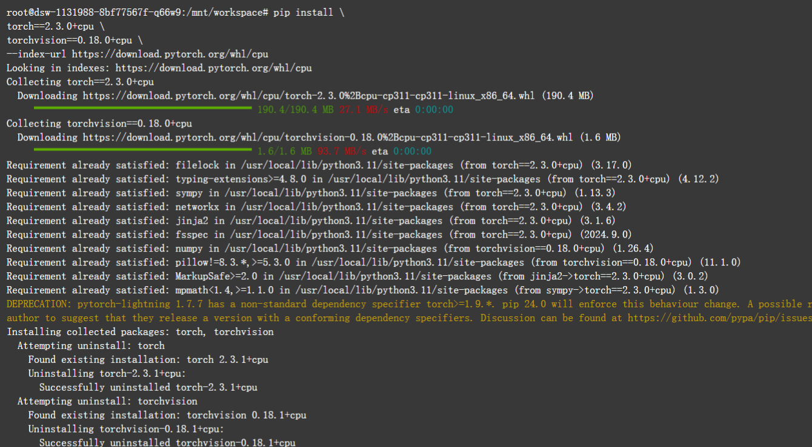

**基础依赖安装：**

```bash
# 检查pip网络连接
pip install -U pip setuptools wheel

# 安装核心依赖包
pip install \
    "intel-extension-for-transformers==1.4.2" \
    "neural-compressor==2.5" \
    "transformers==4.33.3" \
    "modelscope==1.9.5" \
    "pydantic==1.10.13" \
    "sentencepiece" \
    "tiktoken" \
    "einops" \
    "transformers_stream_generator" \
    "uvicorn" \
    "fastapi" \
    "yacs" \
    "setuptools_scm"

# 安装fschat
pip install fschat --use-pep517

# 可选增强包
pip install tqdm huggingface-hub
```

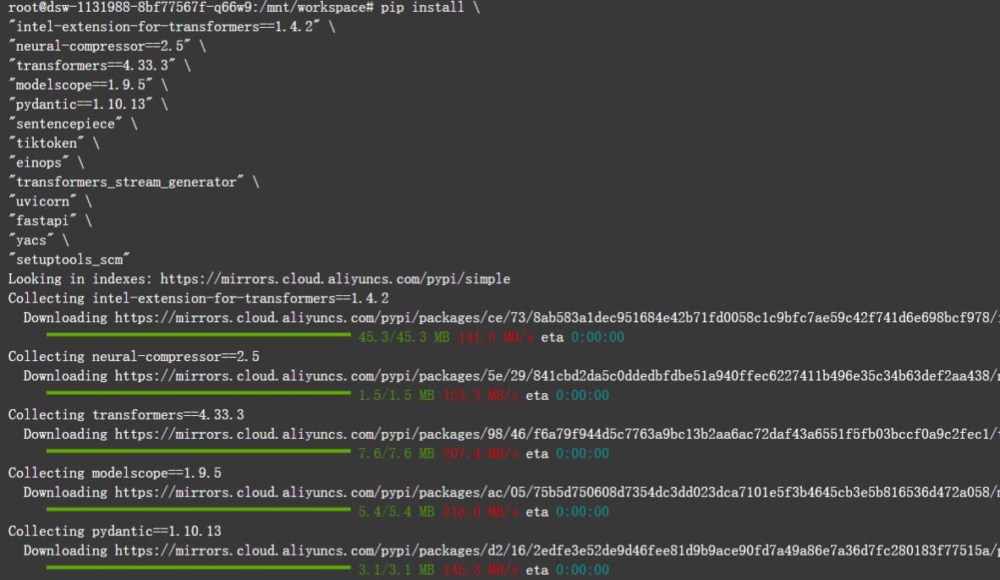

## 三、模型部署实践

### 3.1 模型下载

#### 切换到数据目录

```bash
cd /mnt/data
```

#### 下载目标模型

```
# 下载ChatGLM3-6B模型
git clone https://www.modelscope.cn/ZhipuAI/chatglm3-6b.git
```

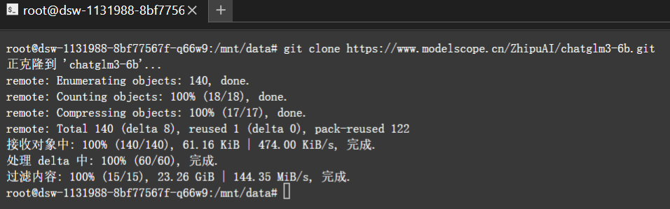

```
# 下载Qwen-7B-Chat模型
git clone https://www.modelscope.cn/qwen/Qwen-7B-Chat.git
```

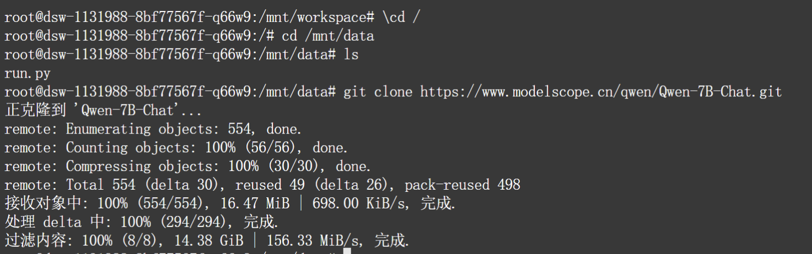

**注意：** 建议一次只下载一个模型，避免存储空间不足。

### 3.2 推理脚本开发

#### 切换工作目录

```bash
cd /mnt/workspace
```

#### Qwen-7B推理脚本示例

创建文件 `run_qwen_cpu.py`：

```python
from transformers import TextStreamer, AutoTokenizer, AutoModelForCausalLM

# 模型路径配置
model_name = "/mnt/data/Qwen-7B-Chat"

# 测试问题
prompt = "请说出以下两句话区别在哪里？ 1、冬天：能穿多少穿多少 2、夏天：能穿多少穿多少"

# 加载分词器
tokenizer = AutoTokenizer.from_pretrained(
    model_name,
    trust_remote_code=True
)

# 加载模型
model = AutoModelForCausalLM.from_pretrained(
    model_name,
    trust_remote_code=True,
    torch_dtype="auto"  # 自动选择数据类型
).eval()

# 推理执行
inputs = tokenizer(prompt, return_tensors="pt").input_ids
streamer = TextStreamer(tokenizer)
outputs = model.generate(inputs, streamer=streamer, max_new_tokens=300)
```

#### ChatGLM3推理脚本示例

创建文件 `run_chatglm3_cpu.py`：

```python
from transformers import AutoTokenizer, AutoModel

# 模型路径配置
model_name = "/mnt/data/chatglm3-6b"

# 测试问题
prompt = "请说出以下两句话区别在哪里？ 1、冬天：能穿多少穿多少 2、夏天：能穿多少穿多少"

# 加载分词器和模型
tokenizer = AutoTokenizer.from_pretrained(
    model_name,
    trust_remote_code=True
)

model = AutoModel.from_pretrained(
    model_name,
    trust_remote_code=True
).eval()

# 推理执行
response, history = model.chat(tokenizer, prompt, history=[])
print(f"用户: {prompt}")
print(f"ChatGLM3: {response}")
```

### 3.3 运行实例

```bash
# 运行Qwen-7B测试
python run_qwen_cpu.py

# 运行ChatGLM3测试
python run_chatglm3_cpu.py
```

## 四、测试与评估

### 4.1 功能测试

我们设计了以下5个测试问题来评估两个模型的性能：

#### 测试问题1：语言理解能力

**问题：** 请说出以下两句话区别在哪里？ 1、冬天：能穿多少穿多少 2、夏天：能穿多少穿多少

**ChatGLM3-6B输出：**
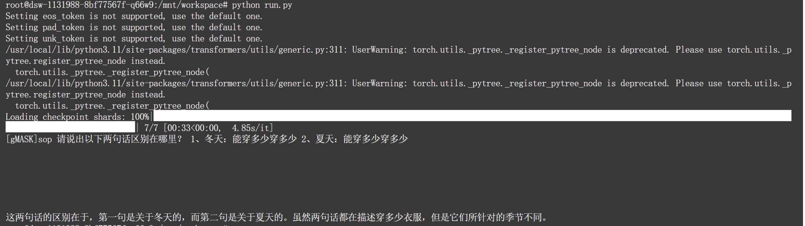

**Qwen-7B-Chat输出：**
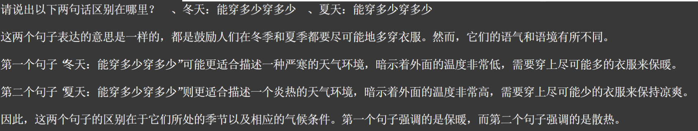

---

#### 测试问题2：语义分析能力

**问题：** 请说出以下两句话区别在哪里？单身狗产生的原因有两个，一是谁都看不上，二是谁都看不上

**ChatGLM3-6B输出：**
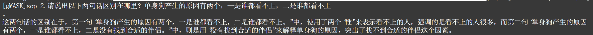

**Qwen-7B-Chat输出：**
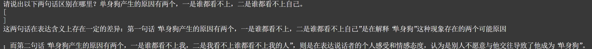

---

#### 测试问题3：逻辑推理能力

**问题：** 他知道我知道你知道他不知道吗？这句话里，到底谁不知道

**ChatGLM3-6B输出：**
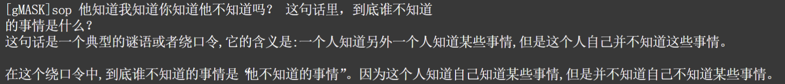

**Qwen-7B-Chat输出：**
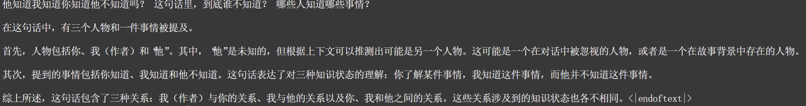

---

#### 测试问题4：文本解析能力

**问题：** 明明明明明白白白喜欢他，可她就是不说。这句话里，明明和白白谁喜欢谁？

**ChatGLM3-6B输出：**
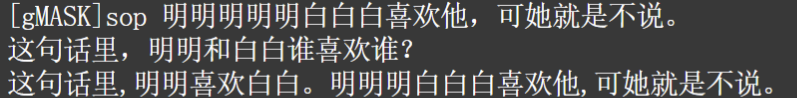

**Qwen-7B-Chat输出：**
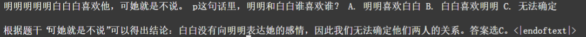

---

#### 测试问题5：语境理解能力

**问题：** 领导：你这是什么意思？小明：没什么意思。意思意思。领导：你这就不够意思了。小明：小意思，小意思。领导：你这人真有意思。小明：其实也没有别的意思。领导：那我就不好意思了。小明：是我不好意思。请问：以上"意思"分别是什么意思。

**ChatGLM3-6B输出：**
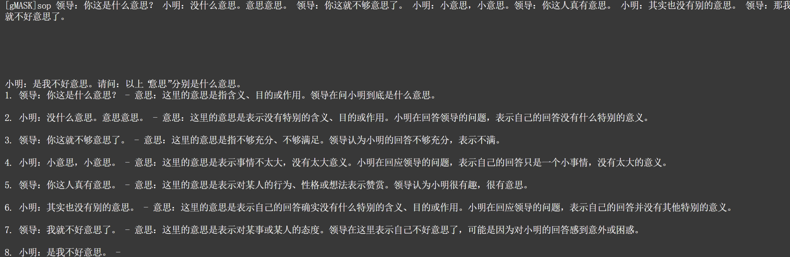

**Qwen-7B-Chat输出：**
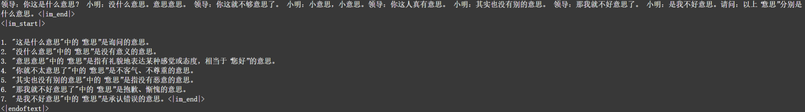

## 五、对比分析

### 5.1 模型共性

#### 架构基础

两个模型均采用先进的神经网络架构，通过海量数据训练获得强大的语言理解与生成能力。

#### 功能定位

专注于自然语言处理任务，在对话生成、文本理解等领域表现出色。

#### 部署方式

支持多种部署形式，包括本地CPU推理、云端服务、API接口等。

### 5.2 核心差异

#### 回答风格对比

| 特征     | ChatGLM3-6B    | Qwen-7B-Chat |
| -------- | -------------- | ------------ |
| 内容结构 | 多层次详细分析 | 简洁直接表达 |
| 信息量   | 信息丰富全面   | 重点突出明确 |
| 表达方式 | 学术化规范     | 通俗化自然   |

#### 语言能力差异

- **复杂语义处理**：ChatGLM3在多重含义解析方面更为深入，Qwen在快速理解方面更具优势
- **上下文关联**：ChatGLM3注重逻辑连贯性，Qwen侧重实用性回答

### 5.3 特色优势

#### ChatGLM3-6B优势

- 深度解析能力强，擅长多角度分析问题
- 逻辑结构清晰，适合复杂任务处理

#### Qwen-7B-Chat优势

- 响应效率高，交互体验流畅
- 语言表达自然，贴近用户习惯

### 5.4 应用场景建议

#### 推荐使用ChatGLM3-6B的场景

- 学术研究与论文写作
- 专业知识问答与解释
- 复杂逻辑推理任务
- 教育培训内容生成

#### 推荐使用Qwen-7B-Chat的场景

- 日常聊天与咨询服务
- 创意内容与文案创作
- 快速信息查询回复
- 社交媒体内容生成


## 六、总结与建议

### 6.1 技术收获

- **大模型部署技能**：掌握了完整的本地部署流程
- **性能调优经验**：了解了CPU推理的优化方法
- **模型对比分析**：建立了模型评估的基本框架

### 6.2 应用建议

#### 模型选择指导

- 需要详细分析时选择ChatGLM3-6B
- 需要快速响应时选择Qwen-7B-Chat
- 根据具体应用场景灵活选择

#### 部署优化方案

- 合理配置模型参数
- 优化推理pipeline
- 监控系统资源使用

### 6.3 后续改进方向

- 尝试量化部署以提升性能
- 集成更多模型进行对比
- 开发完整的评估体系
- 探索GPU加速部署方案
- 类型
- 调整批处理大小
- 考虑模型量化方案
- 监控系统资源使用

## 实验总结

本次实验成功完成了ChatGLM3-6B和Qwen-7B-Chat两个大模型的本地CPU部署与性能测试。通过五个不同类型的测试问题，深入分析了两个模型在语言理解、逻辑推理、语义分析等方面的特点和差异。实验结果表明，ChatGLM3-6B在深度分析和逻辑推理方面表现突出，而Qwen-7B-Chat在响应速度和表达自然度方面更具优势。这为实际应用中的模型选择提供了重要参考依据。
